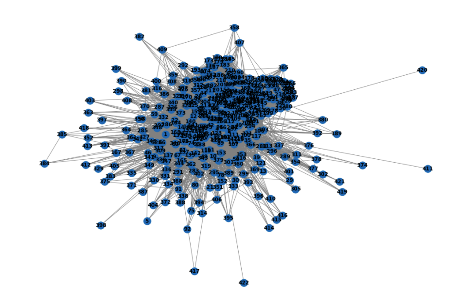
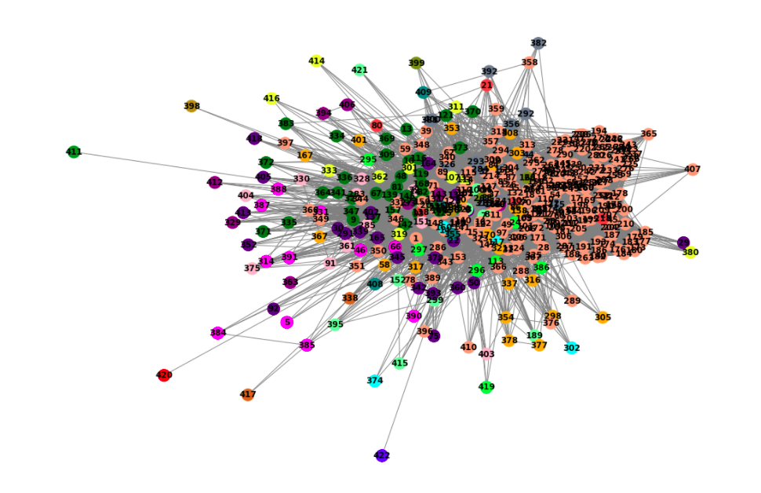
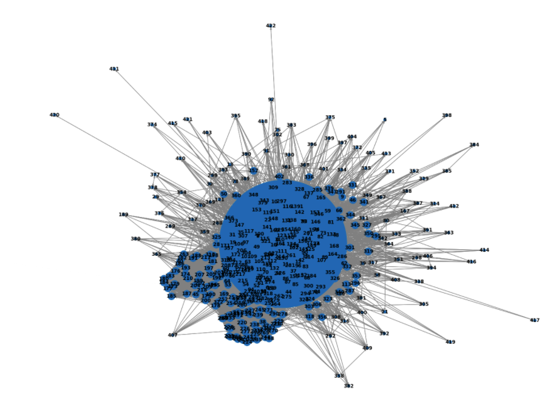
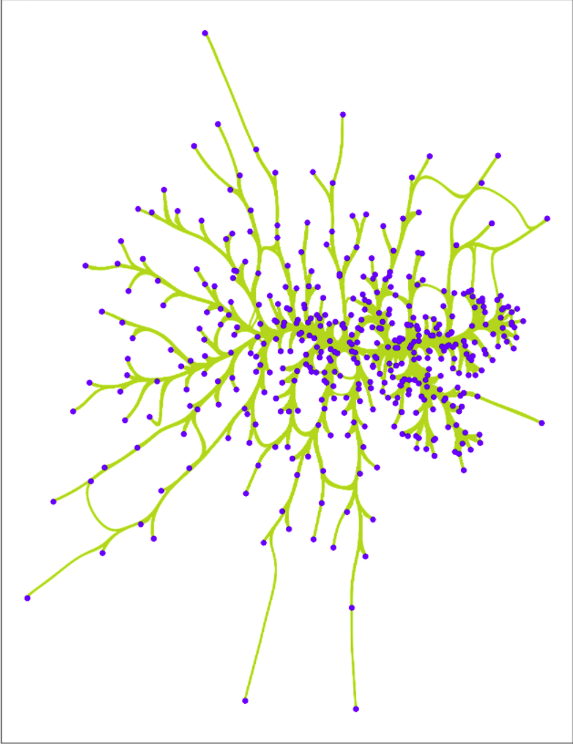
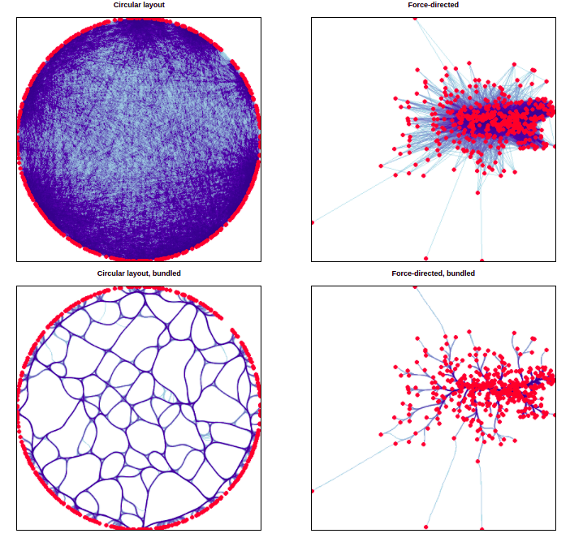

# Summary about the project

<!-- TABLE OF CONTENTS -->
<details>
  <summary>Table of Contents</summary>
  <ol>
    <li><a href="#overview">overview</a></li>
    <li><a href="#instructions-to-Run-this-repository">Instructions to Run this repository</a></li>

</details>


<!-- Overview -->
# Overview 

The graph in Neo4j is analysed using Networkx. This project uses the neo4j graph from the [project](https://github.com/Ganesamanian/Working-with-BabelNet).

<p align="right">(<a href="#top">back to top</a>)</p>


<!-- Instructions to Run this repository -->
# Instructions to Run this repository
1. Clone [this](https://github.com/Ganesamanian/Graph-analysis-using-Networkx-) repository using 
   ```
   git clone https://github.com/Ganesamanian/Graph-analysis-using-Networkx.git
   ```
2. Install the following packages using `pip`.
   ```
   pip install networkx
   pip install GraphDatabase
   pip install numpy
   pip install matplotlib
   ```
3. Navigate to the file `Code/Pagerank_Bablenet.ipynb`. Change the neo4j credentials to your Neo4j credentials which the graph need to be analysed 

4. Run the file sequentially to extract the graph, save the graph and analyse it

5. Below is the code block to extract the graph using cypher query

  ```python
        def neo4jReturn(cypherTxt):

        results = driver.session().run(cypherTxt)
        nodes = list(results.graph()._nodes.values())
        rels = list(results.graph()._relationships.values())

        return (nodes, rels)
        
        
        if __name__ == '__main__':
    
	  
	driver = GraphDatabase.driver(
	        uri="bolt://localhost:3687", 
	        auth=("neo4j", "babelnet"))
	    
	
	txt = """
	      //html page 
	      match (p:Babelnet)-[r]-()
	      return p, r
	      """
	    
	
	nodes, rels = neo4jReturn(txt)
    ```
 
6. Below is the code block to cluster the graph spectrally

  ```python
        def find_second_small_eig(vector):

	    second_index = 0
	    min_value = vector.min()
	    second_value = vector.max()
	    for index in range(len(vector)):
		if vector[index] > min_value and vector[index] < second_value:
		    second_index = index
		    second_value = vector[index]
	    return second_index


	# Function to compare the low conductance
	def mycmp(x, y):

	    if int(x) > int(y):
		return 1
	    return -1


	# Function to cluster the graph
	# based on fiedler vector
	def spectral_clustering(G, k_clustering = 3):
	    
	    starttime = datetime.datetime.now()
	    
	    # Cluster numbers     
	    clustering_count = 1
	    clusters = []

	    clusters.append(list(G.nodes))

	    for iter in range(k_clustering - 1):

		# Constructing Laplacian Matrix L
		large_size = 0
		large_index = 0

		for i in range(len(clusters)):
		    length = len(clusters[i])
		    if length > large_size:
		        large_index = i
		        large_size = length

		cluster_nodes = clusters[large_index]
		sub_G = G.subgraph(cluster_nodes)
		A = nx.to_numpy_matrix(sub_G)

		D = np.diag([d for n, d in sub_G.degree()])
		L = D - A

		w, v = LA.eig(L)
		second_index = 0

		# Find the second Eigen vector
		second_small_index = find_second_small_eig(w)

		index = 0
		sum = 0
		degrees = [n for n, d in sub_G.degree()]
		part1 = []
		part2 = []


		# Based on selected K nodes repeat the loop
		for i in v[:,second_small_index]:
		    sum += i[0]
		    if i > 0:
		        part1.append(degrees[index])
		    else:
		        part2.append(degrees[index])
		    index += 1


		clusters.remove(cluster_nodes)
		clusters.append(part1)
		clusters.append(part2)


	    return k_clustering, clusters
 ```
  
 7. Code block to analyse the pagerank
 
   ```python
	def pagerank(DiG):

	    pr = nx.pagerank(DiG, alpha=0.85)
	    pr_size = [round(v,4) * 50e4 for v in pr.values()]
	    values = {i:"{:.4f}".format(j) for i, j in zip(range(0,416), list(pr.values()))}
	    
	    names = {dict(DiG.nodes.data('name'))[i]:"{:.4f}".format(j) \
		     for i, j in zip(range(0,416), list(pr.values()))}
	    
	    
	    print("Plotting pagerank graph without weights")
	    plt.figure(figsize=(20,15))	  
	    pos = nx.spring_layout(DiG)	    
	    nx.draw(DiG, pos, with_labels=True, 
		    edge_color = "grey", font_weight='bold')    
	    plt.show()
	    
	    
	    plt.figure(figsize=(20,15))    
	    nx.draw(DiG, pos, node_size=pr_size, edge_color = "grey", 
		    with_labels=True, font_weight='bold')    
	    
	    plt.show()
	    return names
 ```
  
 8. Also the graph can be analysed in different ways as shown below
 
 
 
 
 9. Also there are other different ways of analysis plotted using plotly produced in the [folder](https://github.com/Ganesamanian/Graph-analysis-using-Networkx-/tree/master/Output)`Output`

<p align="right">(<a href="#top">back to top</a>)</p>


